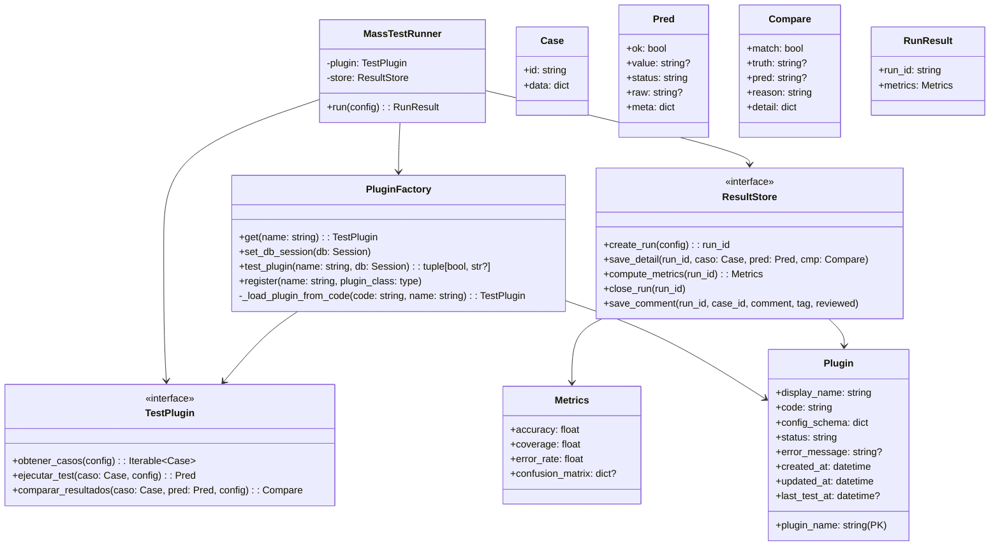
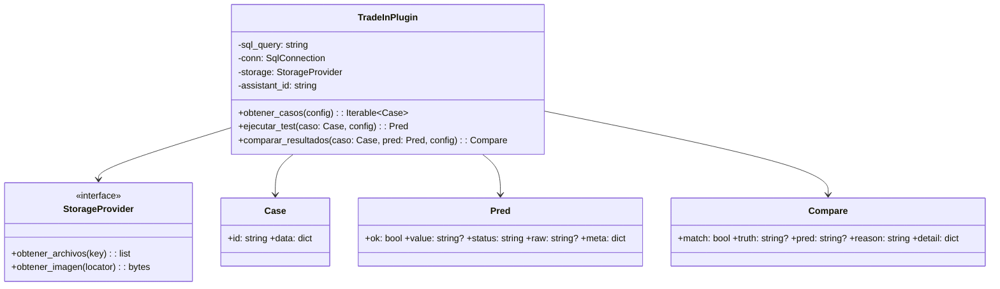
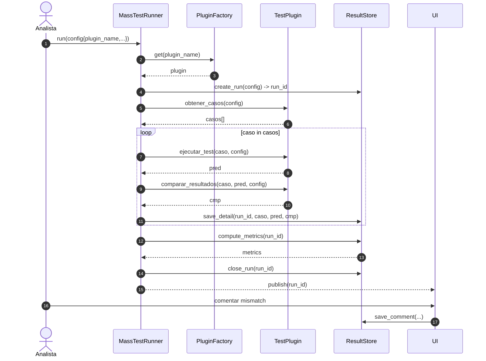

## Propuesta simplificada: “Plugin” + Runner + Store

### Qué queda fijo (framework)

* `MassTestRunner`
* `ResultStore`
* DTOs simples (`Case`, `Pred`, `Compare`)

### Qué cambia por bot/dominio

* **Un solo objeto**: `TestPlugin`

---

## Diagrama de clases Mermaid (simple y usable)

---

## Concreto TradeIn (sin ensuciar la abstracción)

Acá TradeIn implementa **un solo plugin**, y adentro hace lo que necesite (SQL, imágenes, assistant, etc.) sin forzar interfaces extra.

> Nota: dentro de `Case.data` podés llevar `id_caso`, `nro_pedido`, `resultado_final`, `resultado_operador`, `tabulacion`, etc. **sin que el framework lo sepa**.

---

## ZenUML (Mermaid sequence) alineado a esta versión simple

---

## Por qué esta abstracción es “la correcta” para vos

* **Solo 1 punto de extensión** (el Plugin) → menos boilerplate.
* Igual te permite tener **múltiples implementaciones** (TradeInPlugin, BotXPlugin, etc.).
* Te deja “probar múltiples diagramas” y lógicas cambiando `plugin_name`, sin rediseñar todo.
* Si mañana necesitás más fine-grain, podés **refactorizar internamente** el plugin a strategies, pero sin imponerlo a todo el sistema.
 